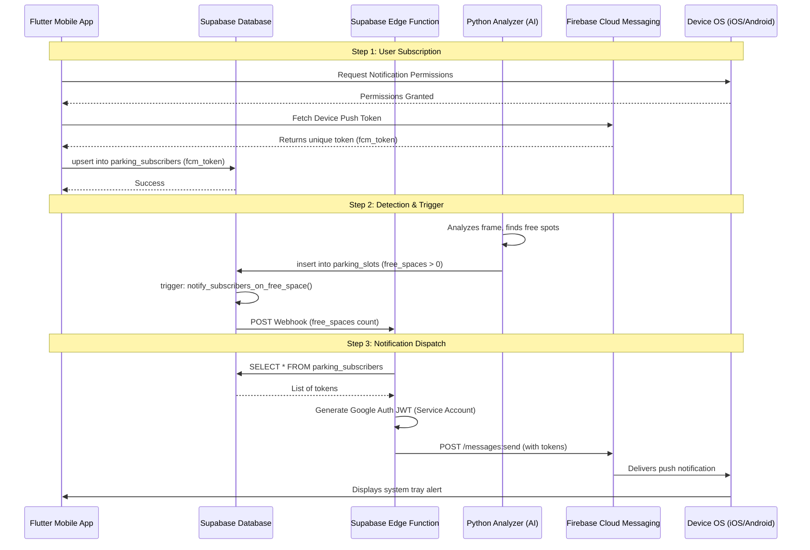

# Notification System Architecture

This diagram illustrates the flow of the parking notification system, from user subscription to the delivery of background push notifications via Firebase.

### Component Details:
1. **Flutter Mobile App:** Handles user intent, OS permissions, and registration of the physical device address in the cloud.
2. **Supabase Database:** Acts as the central state store and event bus. A PL/pgSQL trigger selectively fires only when the parking status changes from full to available.
3. **Supabase Edge Function:** A serverless Deno runtime that performs secure tasks (FCM authentication) that shouldn't be handled directly in the database.
4. **Python Analyzer:** The AI brain that continuously monitors the RTSP stream. It is "status-change-aware" to avoid flooding the database with identical heartbeats.
5. **Firebase Cloud Messaging (FCM):** The delivery infrastructure provided by Google that handles routing the message to the correct physical device across any network.
